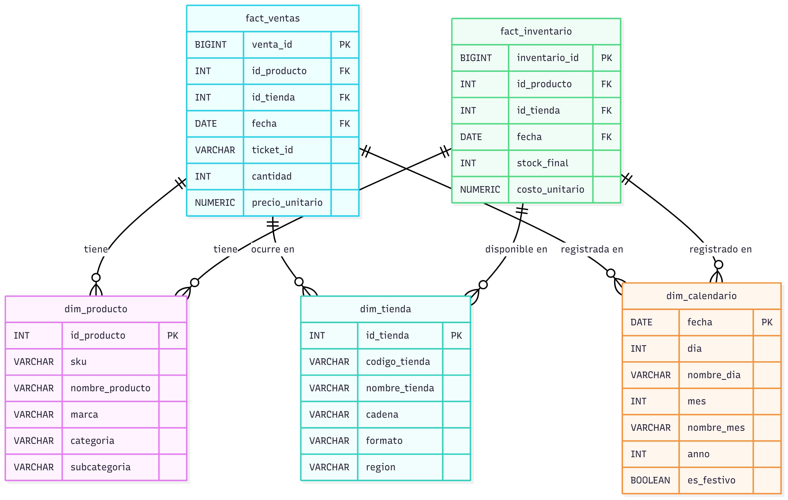

# Explicación del Proyecto: Data Warehouse Analítico para Retail

## Data Engineer II Challenge - Por Edgar Axel Flores Diaz

---

## 1. Resumen Ejecutivo

Este documento detalla la solución implementada para el desafío de Data Engineer II, que consistió en diseñar, construir y desplegar un Data Warehouse (DW) analítico para una cadena de retail. El proyecto se desarrolló utilizando **PostgreSQL** y se desplegó en **AWS RDS (Free Tier)**, demostrando no solo la capacidad de modelar datos, sino también de optimizar consultas y gestionar infraestructura en la nube.

La solución final es un sistema robusto, cargado con más de **12.9 millones de registros de ventas** simulados a lo largo de 5 años, que responde a complejas preguntas de negocio en segundos. Mediante técnicas de optimización como el particionamiento, la indexación estratégica y el uso de vistas materializadas, se lograron **mejoras de rendimiento de hasta un 99.9%** en consultas críticas.

Este proyecto abarca el ciclo de vida completo de un producto de datos: desde la definición de los requerimientos de negocio hasta el despliegue, la optimización y la documentación exhaustiva.

**Enlaces Rápidos a la Documentación Detallada:**

- [Decisiones de Arquitectura y Justificaciones](./architecture_decisions.md)
- [Requerimientos de Negocio y Casos de Uso](./business_requirements.md)
- [Diccionario de Datos Completo](./diccionario_datos.md)
- [Guía de Despliegue en AWS RDS](./DEPLOYMENT_GUIDE.md)
- [README del Repositorio](../README.md)

---

## 2. Objetivo y Casos de Negocio

El objetivo principal fue construir un modelo analítico **escalable y performante** que permitiera a una empresa de retail tomar decisiones basadas en datos. Para lograrlo, se plantearon y resolvieron 5 casos de negocio clave:

1. **Análisis de Ventas Diarias y Semanales:** Para dashboards ejecutivos que monitorean el pulso del negocio.
2. **Rendimiento de Productos:** Para identificar los productos estrella por región y optimizar el inventario.
3. **Análisis del Ticket Promedio:** Para entender patrones de compra por formato de tienda y región.
4. **Gestión de Inventario:** Para generar alertas proactivas de `SIN_STOCK` o `STOCK_BAJO` y optimizar la rotación.
5. **Análisis de Estacionalidad:** Para planificar campañas de marketing y la demanda en picos estacionales como Navidad.

Estos casos de uso guiaron el diseño del modelo de datos y las estrategias de optimización.

---

## 3. Arquitectura y Modelo de Datos

La arquitectura se centró en un **Esquema Estrella**, un estándar de la industria para Data Warehousing por su simplicidad y alto rendimiento en consultas analíticas.

- **Tablas de Hechos (Facts):**
  - `fact_ventas`: Almacena el detalle de cada línea de producto por transacción. Es la tabla más grande y está **particionada por año** para acelerar las consultas con filtros de fecha.
    - `fact_inventario`: Contiene snapshots mensuales del inventario por producto y tienda.
- **Tablas de Dimensiones (Dimensions):**
  - `dim_producto`: Catálogo único de productos.
  - `dim_tienda`: Jerarquía de tiendas (cadena, formato, región).
  - `dim_calendario`: Dimensión de tiempo para facilitar análisis de estacionalidad.

Para una descripción detallada de cada tabla y columna, por favor consulte el [**Diccionario de Datos**](./diccionario_datos.md). Las justificaciones detrás de cada decisión de diseño (particionamiento, tipos de datos, etc.) se encuentran en el documento de [**Decisiones de Arquitectura**](./architecture_decisions.md).

---

## 4. Generación de Datos y Carga (ETL)

Para validar el modelo bajo una carga realista, se generaron datos sintéticos utilizando un script de **Python** con las librerías `pandas` y `faker`.

- **Volumen:**
  - **+12.9 millones** de registros de ventas.
  - **+1 millón** de registros de inventario.
  - 325 tiendas y 125 productos.
- **Proceso de Carga:**
    1. El script `00_generate_data.py` genera archivos CSV.
    2. Se utiliza el comando `\copy` de `psql` para realizar una carga masiva de datos (bulk load) a la base de datos en RDS, siendo este el método más performante para grandes volúmenes.

---

## 5. Optimización de Rendimiento: Resultados

La optimización fue un pilar central del proyecto. Se aplicaron tres técnicas principales:

1. **Particionamiento de Tablas:** La tabla `fact_ventas` se dividió en particiones anuales, permitiendo que PostgreSQL ignore los datos de años no relevantes en una consulta (`partition pruning`).
2. **Indexación Estratégica:** Se crearon índices compuestos (`B-Tree`) en las columnas más utilizadas en los `JOINs` y filtros `WHERE`.
3. **Vistas Materializadas:** Para las consultas más pesadas y frecuentes (típicas de un dashboard), se pre-calcularon los resultados en vistas materializadas, convirtiendo consultas de segundos en respuestas de milisegundos.

Los resultados demuestran el impacto masivo de estas técnicas:

| Consulta | Tiempo Antes (ms) | Tiempo Después (ms) | Mejora (%) |
| :--- | :--- | :--- | :--- |
| **Ventas Diarias** | 11,195 | 4,496 | **59.8%** |
| **Top Productos** | 5,415 | 4.7 | **99.9%** |
| **Análisis de Inventario** | 14,582 | 22.6 | **99.8%** |

El análisis detallado de los planes de ejecución (`EXPLAIN ANALYZE`) se encuentra en la carpeta `explain/` del repositorio.

---

## 6. Despliegue en AWS

La solución fue desplegada en una instancia **PostgreSQL de AWS RDS (db.t3.micro)**, respetando las limitaciones de la capa gratuita (Free Tier). Se configuró el acceso público de forma temporal y segura, limitando las conexiones a IPs específicas a través de los **Grupos de Seguridad** de la VPC.

Este enfoque demuestra la capacidad de trabajar en un entorno de nube realista, gestionando la infraestructura, la seguridad y los costos de manera efectiva.
